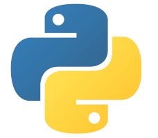

<br/><br/>

# Práctica 1 - Utilidades


## Contenido

- [Práctica 1 - Utilidades](#práctica-1---utilidades)
  - [Contenido](#contenido)
  - [Requisitos previos](#requisitos-previos)
  - [Convenciones](#convenciones)
  - [Objetivos](#objetivos)
  - [Introducción](#introducción)
  - [Actividades de la práctica](#actividades-de-la-práctica)
    - [1. Conversor de criptomonedas](#1-conversor-de-criptomonedas)
    - [2. Contador de vocales](#2-contador-de-vocales)
    - [3. Detector de palíndromos](#3-detector-de-palíndromos)
    - [4. Detector de máximos de temperaturas](#4-detector-de-máximos-de-temperaturas)
    - [5. Lista de la compra](#5-lista-de-la-compra)
    - [6. Cifrado de texto (opcional)](#6-cifrado-de-texto-opcional)
    - [7. Menú de selección](#7-menú-de-selección)
  - [Entrega de la práctica](#entrega-de-la-práctica)
  - [Anexos](#anexos)
    - [Evaluación](#evaluación)
  - [Enlaces](#enlaces)

## Requisitos previos

Disponer de una versión de Python igual o superior a 3.8, y del entorno de desarrollo Visual Studio Code.

## Convenciones

Durante la práctica se utilizarán tres tipos de código. Por un lado, código a escribir en la línea de comandos
(_command line_), también conocida como terminal o consola. En el ejemplo de abajo, vemos cómo ejecutamos
el comando `python --version`, que imprime por pantalla la versión de Python en el sistema.


```shell
$ python --version
Python 3.8.10
```

Por otro lado, hay fragmentos de sesión del intérprete de comandos de python.
Podemos acceder al intérprete directamente ejecutando el comando Python en nuestra terminal:


```shell
$ python
Python 3.8.10 (default, Jun  2 2021, 10:49:15) 
[GCC 9.4.0] on linux
Type "help", "copyright", "credits" or "license" for more information.
>>> 
```

En este punto, podemos empezar a introducir nuestro código Python.
Las líneas introducidas por el usuario son las que empiezan con "`>>>`" o "`...`", como en el ejemplo siguiente:


```pycon
>>> print("Esto es código Python")
Esto es código python
>>> a = 2
>>> for i in range(a):
...     print(i)
...
0
1
```

Finalmente, habrá código de ejemplo en Python, que deberemos guardar en un fichero de texto:



```python
def funcion(parametro):
   return
```

También utilizaremos notas para resaltar consejos o aspectos importantes:

***
_**Nota**: todas las líneas ejecutadas durante una sesión de python o de consola se guardan en el historial. Se puede acceder a una línea anterior mediante las flechas del teclado o pulsando `Ctrl+P` repetidamente hasta llegar a la línea deseada._
***

## Objetivos

-   Uso interactivo del intérprete de Python (REPL)
-   Uso básico de un IDE (Visual Studio Code) para desarrollar y ejecutar código
-   Creación, modificación y recorrido de listas
-   Manipulación de cadenas de texto
-   Uso de estructuras de control básicas: if, else, for...

## Introducción

En esta práctica exploraremos conceptos básicos en python mientras implementamos varias funcionalidades que nos pueden ser útiles en el día a día:

-   Conversor de criptomonedas
-   Contador de vocales
-   Detector de palíndromos
-   Detector de máximos de temperatura
-   Cifrado de mensajes de texto
-   Lista de la compra

El primer paso para desarrollar la práctica es descargar los ficheros necesarios del repositorio de Github. El método más sencillo es a través del botón `Code->Download ZIP`. Los dos ficheros necesarios para la práctica son `utilidades.py` y `test.py` (ver sección [Evaluación](#evaluación)).

Todas las funciones que se piden deben añadirse al fichero con nombre `utilidades.py`, y deberá entregarse en la tarea de Moodle del `Proyecto 1 - Utilidades`. 
Inicialmente el fichero contiene algo parecido a esto:


```python
EURO_BITCOIN_RATE = 44471.78

def sumar_numeros(num1, num2):
    '''Suma los dos numeros proporcionados.'''
    suma = num1 + num2
    return suma

def euros_a_bitcoins(euros):
  '''Convierte una cantidad de euros a bitcoins. 1 bitcoin = 44570.17 €'''
  raise NotImplementedError

def bitcoins_a_euros(usd):
  '''Convierte una cantidad de bitcoins a euros. 1 bitcoin = 44570.17 €'''
  raise NotImplementedError
```

Por un lado, define el ratio de conversión de euro a bitcoins. Además, contiene la función de prueba ```sumar_numeros```, que toma como parámetros dos números y devuelve la suma. Por último, contiene el esqueleto de dos de las funciones a desarrollar en esta práctica.

Para su edición, se puede usar cualquier IDE, aunque se recomienda Visual Studio Code. El fichero ```test.py``` se puede usar opcionalmente para comprobar que las funciones desarrolladas en la práctica funcionan correctamente, como se explicará más adelante.

Para cada una de estas funcionalidades se proporcionará la firma (esqueleto) de la función a cumplir.
Por ejemplo, para una funcionalidad como "elevar un número al cuadrado" podría proporcionarse el siguiente código:


```python
def al_cuadrado(numero):
  ''' Función que devuelve el resultado de elevar un número dado al cuadrado '''
  raise NotImplementedError
```

En este caso, vemos que la función ha de llamarse "_al\_cuadrado_", aceptar un único argumento (_numero_), y la documentación de la función nos dice cuál es el funcionamiento esperado de la función.

Una solución en este caso podría ser la siguiente:


```python
def al_cuadrado(numero):
  ''' Función que devuelve el resultado de elevar un número dado al cuadrado '''
  return numero**2
```

Tras implementar todas las funcionalidades del proyecto, la última tarea será desarrollar un programa con un menú interactivo que permitirá a los usuarios utilizar las funciones que hemos desarrollado.

## Actividades de la práctica

### 1. Conversor de criptomonedas

La primera tarea es muy sencilla: escribir una función que permita convertir de euros a bitcoins, y otra que haga el proceso inverso.

Las funciones deben cumplir esta especificación:


```python
def euros_a_bitcoins(euros):
  '''Convierte una cantidad de euros a bitcoins. 1 bitcoin = 44570.17 €'''
  raise NotImplementedError

def bitcoins_a_euros(usd):
  '''Convierte una cantidad de bitcoins a euros. 1 bitcoin = 44570.17 €'''
  raise NotImplementedError
```

Un ejemplo de uso sería el siguiente (asumiendo que el intérprete se lanza en la carpeta donde se encuentra `utilidades.py`):


```pycon
>>> import utilidades
>>> utilidades.euros_a_bitcoins(10000)
0.22
>>> utilidades.bitcoins_a_euros(2)
89140.34
```

_**Nota**: El valor de las criptomonedas fluctúa enormemente. Por simplicidad en la corrección, tome como valor de conversión 1 bitcoin = 44570.17 € (aunque no sea el valor real en el momento en el que realice la práctica). El resultado se redondea a 2 decimales. Véase la función ```round```<sup>[2](#round)</sup>._

_**Nota**: Si cambiamos el fichero `utilidades.py` después de haber importado el fichero, deberemos reiniciar nuestro intérprete (opción fácil), o recargar el módulo usando un código como el siguiente: `import importlib;importlib.reload(utilidades)` (opción cómoda pero avanzada)._

### 2. Contador de vocales

La siguiente funcionalidad consiste en obtener el número total de vocales que tiene un texto.
Para simplificar el proceso, se recomienda usar el método ```lower```<sup>[3](#lower)</sup> de `string` para convertir el texto en minúsculas antes de realizar la cuenta.

Con esta información, ha de escribirse la siguiente función:


```python
def contar_vocales(texto):
  '''Devuelve el número de vocales que tiene el texto dado.'''
  raise NotImplementedError
```

Como ejemplo de uso:


```pycon
>>> contar_vocales('texto de ejemplo')
6
>>> contar_vocales('CINCO vocales')
5
>>> contar_vocales('pan')
1
```

### 3. Detector de palíndromos

A continuación, se pide desarrollar una función que sea capaz de detectar si una palabra o frase es o no un palíndromo. Un palíndromo es una palabra o frase que se lee igual en un sentido que en otro (por ejemplo; Ana, rayar, kayak, 2002).

Si el texto es una frase y contiene espacios, se pueden ignorar completamente.
Para ello se recomienda el método ```replace```<sup>[4](#replace)</sup>.

La función a desarrollar debe cumplir la siguiente especificación:


```python
def es_palindromo(texto):
  '''Detecta si un texto es palíndromo o no'''
  raise NotImplementedError
```

Un ejemplo de uso sería el siguiente:


```pycon
>>> es_palindromo('Roma ni se conoce sin oro ni se conoce sin amor')
True
>>> es_palindromo('Este texto no es palindromo')
False
```

### 4. Detector de máximos de temperaturas

El objetivo de esta tarea es desarrollar una función que, dada una lista de temperaturas, sea capaz de obtener sólo las que superan cierto umbral.
La función debe cumplir la siguiente especificación:


```python
def max_temperaturas(temperaturas, umbral):
  '''Detecta qué mediciones de temperatura han superado el umbral dado'''
  raise NotImplementedError
```

Un ejemplo de uso sería el siguiente:


```pycon
>>> max_temperaturas([23.2, 25.3, 45.0, 18.0, 59.3], 30.0)
[45.0, 59.3]
>>> max_temperaturas([23.2, 25.3, 45.0, 18.0, 59.3], 60.0)
[]
```

### 5. Lista de la compra

En esta parte crearemos una versión muy simplificada de una lista de la compra, y veremos algunas operaciones básicas: añadir y borrar productos, comprobar el número de productos existentes y mostrar todos los productos.


```python
def insertar(producto):
  '''Añade un producto a la lista'''
  raise NotImplementedError

def borrar(numero):
  '''Devuelve el producto en el índice dado de lista de productos.'''
  raise NotImplementedError

def lista_productos():
  '''Devuelve los producto en formato lista.'''
  raise NotImplementedError

def productos():
  '''Muestra la lista de productos con sus índices.'''
  raise NotImplementedError

def cantidad():
  '''Devuelve el número de productos.'''
  raise NotImplementedError
```

Este es un ejemplo de uso:


```pycon
>>> lista_productos()
[]
>>> productos()
No hay productos
>>> insertar('Arroz integral')
>>> insertar('Berenjenas')
>>> productos()
0: Arroz integral
1: Berenjenas
>>> cantidad()
2
>>> borrar(0)
>>> productos()
0: Berenjenas
>>> cantidad()
0
```

### 6. Cifrado de texto (opcional)

En este apartado **opcional** escribiremos un sistema para intercambiar mensajes cifrados, utilizando uno de los sistemas más simples, el cifrado César<sup>[5](#cesar)</sup>.
Este sistema de cifrado reemplaza cada una de las letras de un texto por otra que se encuentra a una distancia dada en el alfabeto.
Por simplicidad, sólo se tendrán en cuenta las letras de la A a la Z, y todo el texto será convertido a mayúsculas.


```python
def cifrar(texto, desplazamiento):
  '''
  Transforma un texto dado usando cifrado César con un desplazamiento dado.

  Utiliza esta lista de caracteres: ABCDEFGHIJKLMÑOPQRSTUVWXYZÁÉÍÓÚ
  
  Si un caracter no se encuentra en la lista, se deja intacto.
  '''
  raise NotImplementedError

def descifrar(cifrado, desplazamiento):
  '''
  Aplicada a un texto cifrado con el mismo desplazamiento,
  devuelve el texto original.
  '''
  raise NotImplementedError
```

Este es un ejemplo del uso de las funciones:


```pycon
>>> cifrar('hola mundo', 0)
'HOLA MUNDO'
>>> descifrar('HOLA MUNDO', 0)
'HOLA MUNDO'
>>> cifrar('hola mundo', 20)
'ÉDAU BJNXD'
>>> descifrar('ÉDAU BJNXD', 20)
'HOLA MUNDO'
>>> cifrar('adiós, mundo!', 20)
'UXÍSH, BJNXD!'
>>> descifrar(_, 20)
'ADIÓS, MUNDO!'
```

_**Nota**: En el intérprete, la variable "`_`" (barra baja o underscore) guarda el resultado de la última ejecución._


### 7. Menú de selección

Hasta ahora, la única forma de utilizar las funcionalidades ha sido utilizando código Python.
En este apartado vamos a hacer que nuestro módulo `utilidades.py` se pueda ejecutar de forma interactiva.
Para ello,  un menú interactivo para que el usuario pueda utilizar las funcionalidades implementadas.
Este menú aceptará órdenes línea a línea, de una forma muy parecida al comportamiento del intérprete de Python.
Sin embargo, nuestro menú sólo contará con las siguientes opciones, donde las partes entre ángulos son los argumentos:

-   ```convertir euros bitcoins <cantidad>```
-   ```convertir bitcoins euros <cantidad>```
-   ```contar <texto>```
-   ```palindromo <texto>```
-   ```temperaturas <lista separada por comas> <umbral>```
-   ```cifrar <texto> <desplazamiento>``` (sólo si se implementa el apartado 6)
-   ```descifrar <texto> <desplazamiento>``` (sólo si se implementa el apartado 6)
-   ```productos```
-   ```productos nuevo <nombre>```
-   ```productos borrar <índice>```
-   ```salir```

Para entender mejor el funcionamiento, veamos un ejemplo de uso del menú utilizando todas las opciones:


```shell
$ python utilidades.py
Menú interactivo

-> convertir euros bitcoins 20000
0.45
-> convertir bitcoins euros 2
89140.34
-> contar ejemplo de texto
6
-> cifrar 10 esta tarea es muy fácil
OÍÓK ÓKÉOK OÍ WÚD PFMSV
-> descifrar 15 'CÓI EN ÚBÓVBPÉPSÓB'
SOY UN PROGRAMADOR
-> temperaturas 10.0 20.0 5
[20.0]
-> productos
No hay productos
-> productos nuevo Hummus
0: Hummus
-> productos borrar 0
-> productos
No hay productos
-> prueba
Comando no reconocido
-> no existe
Comando no reconocido
-> salir
¡Adiós!
$ 
```

Para recibir los comandos del usuario, usaremos la función `input`<sup>[6](#input)</sup>, que muestra un mensaje y captura la entrada del usuario hasta que presiona la tecla Enter. Después, devuelve el resultado en forma de ```str```.
Por ejemplo:


```pycon
>>> edad = input('¿Cuántos años tienes? ')
¿Cuántos años tienes? 18
>>> edad
'18'
>>> int(edad)
18
```

_**Nota**: En esta práctica no hace falta tener en cuenta errores por parte del usuario (p.e., introducir letras en lugar de números en la conversión), aunque se sugiere como ejercicio opcional. Si no se ha realizado el ejercicio opcional del cifrado de texto, no hace falta incluirlo en el menú._

## Entrega de la práctica

Para entregar la práctica, se deberá subir a Moodle en <a href="https://moodle.upm.es/titulaciones/oficiales/mod/assign/view.php?id=208687">este enlace</a> el fichero ```utilidades.py```, conteniendo todas las funciones requeridas en la práctica.
La entrega deberá hacerse antes de la fecha especificada en la tarea de Moodle.

</br>
</br>

## Anexos

### Evaluación

En esta tarea se incluye un fichero de pruebas llamado ```test.py```.
Su uso es opcional, pero muy recomendado, ya que permite comprobar de una manera estructurada si las funcionalidades pedidas se han implementado. Para que las pruebas se ejecuten correctamente, el fichero de la solución debe tener el nombre ```utilidades.py``` y estar alojado en la misma carpeta que el fichero de pruebas ```test.py```.

Los tests pueden lanzarse en cualquier momento en la línea de comando.
Si todo está bien implementado, debería obtenerse un resultado parecido a este:


```shell
 $ python test.py
.....
----------------------------------------------------------------------
Ran 8 tests in 0.000s

OK
```


Si existiera algún fallo en la implementación, obtendríamos un error. Por ejemplo, esto es lo que se muestra si dejamos la función `bitcoins_a_euros ` sin definir:


```shell
$ python test.py
======================================================================
ERROR: test_convertir (__main__.TestUtilidades)
----------------------------------------------------------------------
Traceback (most recent call last):
  File "test.py", line 37, in test_convertir
    assert (bitcoins_a_euros(2) - 89140.34) < 1
  File "/home/j/Clases/PROG/2021/p1-utilidades/utilidades.py", line 7, in bitcoins_a_euros
    raise NotImplementedError
NotImplementedError
----------------------------------------------------------------------
Ran 9 tests in 0.000s

FAILED (errors=1)
```


El error nos apunta a la línea del test que encontró el fallo (línea 37) y, en este caso, la línea del código que causó la excepción (línea 7 de ```utilidades.py```).
En caso de tener un error más sutil en el código, sólo veríamos el fallo en la comprobación del test, y tendríamos que investigar el origen.

También es posible ejecutar un subconjunto de las pruebas.
Esto es muy útil al principio, para tener una salida más limpia y facilitar el desarrollo.
Por ejemplo, para ejecutar sólo las pruebas de conversión:


```python
$ python test.py -k convertir
----------------------------------------------------------------------
Ran 1 test in 0.000s

OK
```

__**Nota**:_ las pruebas del ejercicio opcional están comentadas para evitar errores en aquellos que no lo realicen. Quien haya realizado el ejercicio y quiera comprobarlo, puedo hacerlo descomentando los siguientes métodos en el fichero `test.py`:


```python
    def test_cifrar(self):
        assert cifrar('hola mundo', 0) == 'HOLA MUNDO'
        assert cifrar('hola mundo', 20) == 'ÉDAU BJNXD'
        assert cifrar('adiós, mundo', 20) == 'UXÍSH, BJNXD'

    def test_descifrar(self):
        assert descifrar('UXÍSH, BJNXD', 20) ==  'ADIÓS, MUNDO'
        assert descifrar('ÉDAU BJNXD', 20) == 'HOLA MUNDO'
```

## Enlaces

<a name="print">1</a>: https://docs.python.org/es/3/tutorial/inputoutput.html </br>
<a name="round">2</a>: https://www.w3schools.com/python/ref_func_round.asp </br>
<a name="lower">3</a>: https://www.w3schools.com/python/ref_string_lower.asp </br>
<a name="replace">4</a>: https://docs.python.org/3.8/library/stdtypes.html\#str.replace </br>
<a name="cesar">5</a>: https://es.wikipedia.org/wiki/Cifrado_Cesar </br>
<a name="input">6</a>: https://www.w3schools.com/python/ref_func_input.asp </br>
