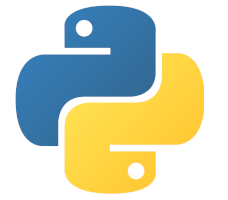

<br/><br/>

# Práctica 3 - Habilidades


## Contenido

- [Práctica 3 - Habilidades](#práctica-3---habilidades)
  - [Contenido](#contenido)
  - [Objetivos](#objetivos)
  - [Requisitos previos](#requisitos-previos)
  - [Introducción](#introducción)
  - [Actividades de la práctica](#actividades-de-la-práctica)
    - [0. Descarga del proyecto](#0-descarga-del-proyecto)
    - [1. Clase habilidad básica](#1-clase-habilidad-básica)
    - [2. Mejorar los mensajes de ayuda](#2-mejorar-los-mensajes-de-ayuda)
    - [3. Utilizar parámetros en nuestras las habilidades](#3-utilizar-parámetros-en-nuestras-las-habilidades)
    - [4. Habilidad de conversión de divisas](#4-habilidad-de-conversión-de-divisas)
    - [5. Menú interactivo](#5-menú-interactivo)
    - [6. Habilidades de la lista de la compra](#6-habilidades-de-la-lista-de-la-compra)
    - [7. Habilidades con subcomandos (Opcional)](#7-habilidades-con-subcomandos-opcional)
    - [8. Refactorización y nuevas habilidades](#8-refactorización-y-nuevas-habilidades)
    - [9. Menús alternativos](#9-menús-alternativos)
    - [10. Otras mejoras opcionales](#10-otras-mejoras-opcionales)
  - [Anexos](#anexos)
    - [Evaluación](#evaluación)
    - [Entrega de la práctica](#entrega-de-la-práctica)
    - [Convenciones](#convenciones)
    - [Enlaces](#enlaces)

## Objetivos

-   Uso interactivo del intérprete de Python (REPL)
-   Uso básico de un IDE (Visual Studio Code) para desarrollar y ejecutar código
-   Uso de clases para encapsular estado y comportamiento
-   Refactorización de un paradigma orientado a funciones a uno orientado a objetos
-   Comprender conceptos básicos de ingenierı́a de software como interfaces

## Requisitos previos

En la realización de este proyecto se ponen en práctica conceptos abordados entre los **temas 1 y 7 de la asignatura**.

Para resolverla, es necesaria una versión de Python igual o superior a 3.10, y se recomienda utilizar el entorno de desarrollo Visual Studio Code.

## Introducción

En prácticas anteriores se han desarrollado varias funciones independientes para cumplir diferentes cometidos: conversión de divisas, lista de la compra, etc. También hemos visto cómo desarrollar menús interactivos que ofrecı́an esas funcionalidades al usuario.

En esta práctica el objetivo es conseguir que cualquier desarrollador pueda programar sus propias funcionalidades, compartirlas con el resto, e introducir funcionalidades desarrolladas por otros usuarios de manera sencilla. Nos inspiraremos directamente en el ejemplo de asistentes personales (p.e., Alexa, Google Assistant y Mycroft), que permiten añadir nuevas funcionalidades personalizadas.

Nuestra solución de prácticas anteriores tiene dos puntos débiles para conseguir este objetivo.
Primero de todo, nos encontramos que algunas funciones están muy relacionadas (p.e., convertir a euros y convertir a bitcoins, o las diferentes funciones relacionadas con la lista de la compra), pero no hay nada en el código que las conecte, no existe una relación explı́cita.
Es decir, para saber qué funciones están relacionadas hay que leer tanto el código como la documentación con detenimiento.
Además de dificultar el entendimiento del código, eso nos puede llevar a código desactualizado y a errores. Por otro lado, para crear los menús de usuario vemos que hay que introducir manualmente las funciones, ya sea usando sentencias de control (**proyecto 1**) o un diccionario de comandos a funciones (**proyecto 2**).

Para solucionar estos problemas, haremos dos cosas.

- **Introduciremos el concepto genérico de habilidad**. Ası́, nos encontrarı́amos la habilidad de convertir divisas, la de gestionar la lista de la compra, etc. Cada una de estas habilidades puede encapsular internamente una o más funciones de las que ya desarrollamos en prácticas anteriores.
- **Modificaremos nuestro menú para que acepte habilidades** en lugar de funciones.

## Actividades de la práctica

### 0. Descarga del proyecto

El primer paso para desarrollar la práctica es descargar los ficheros necesarios del repositorio de Github.
El método más sencillo es a través del botón `Code->Download ZIP`.
Los dos ficheros necesarios para la práctica son `habilidades.py` y `test.py`.
El primero es un fichero de plantilla que contiene la definición de varias funciones que son útiles para la práctica (este será el fichero que se debe entregar en Moodle).
Para su edición, se puede usar cualquier IDE, aunque se recomienda Visual Studio Code.
Para comprobar las soluciones, se proponen dos opciones.
Por otro lado, el fichero `test.py`, se puede usar opcionalmente para comprobar que las funciones desarrolladas en la práctica funcionan correctamente, como veremos más adelante.

El resto de instrucciones siguen las mismas [convenciones](#convenciones) que proyectos anteriores.

### 1. Clase habilidad básica

Vamos a empezar por crear una clase simple para las habilidades.
Por ahora, sólo consideraremos que las habilidades son una entidad (algo) que se puede invocar, y que nos proporcionan algún tipo de ayuda sobre su funcionamiento.
Por ejemplo:



```python
class Habilidad:
  
  def invocar(self):
    print('Se ha invocado una habilidad que no hace nada')
  
  def ayuda(self):
    print('No hay ayuda especı́fica')
```

En este punto, podemos crear varias habilidades, pero no sirve para mucho porque todas las instancias hacen exactamente lo mismo. El resultado es igual que tener una función, pero con engorrosos pasos adicionales:


```pycon
>>> habilidad1 = Habilidad()
>>> habilidad2 = Habilidad()
>>> habilidad1.invocar()
Se ha invocado una habilidad que no hace nada
>>> habilidad2.invocar()
Se ha invocado una habilidad que no hace nada
```

Hagamos las habilidades algo más interesantes añadiéndoles algo de estado.
El estado es un conjunto de valores internos en cada instancia de la clase.
En nuestro caso, añadiremos un nombre para la habilidad y un pequeño texto de descripción de la habilidad.
El nombre nos permitirá diferenciar entre habilidades de la misma clase en nuestro menú, y la descripción será útil para el usuario cuando implementemos un menú.

Si no se proporciona una descripción al crear una instancia, se reutilizará por defecto la documentación de la clase en cuestión.
Esto es muy parecido a lo que hicimos en prácticas anteriores.
El resultado es este:


```python
class Habilidad:
  '''Abstracción del concepto de habilidad en un asistente.'''

  def __init__(self, nombre, descripcion='Sin descripción'):
    self.nombre = nombre
    self.descripcion = descripcion

  def invocar(self):
    """Invocar la habilidad. No acepta parámetros"""
    print(f'Se ha invocado la habilidad {self.nombre}')

  def ayuda(self):
    """Devolver la descripción de la habilidad"""
    print('No hay ayuda específica')
```


Con esta nueva clase podemos crear instancias diferentes, que no se comportan del todo igual, porque su estado interno es diferente. Por ejemplo:

```
>>> habilidad1 = Habilidad(1)
>>> habilidad2 = Habilidad(2)
>>> habilidad1.invocar()
Se ha invocado la habilidad 1
>>> habilidad2.invocar()
Se ha invocado la habilidad 2
>>> habilidad2.nombre
2
>>> habilidad2.descripcion
'Sin descripción'
>>> habilidad3 = Habilidad(3, descripcion='descripción personalizada')
>>> habilidad3.descripcion
'descripción personalizada'
```

Además, podemos crear nuevas clases que hereden de la clase Habilidad:


```python
class Saludar(Habilidad):
  """Saludar, dando el nombre indicado en self.nombre"""
  def invocar(self):
    print(f'Hola, soy {self.nombre}')

class Despedir(Habilidad):
  """Despedirse, dando el nombre indicado en self.nombre"""
  def invocar(self):
    print(f'Adiós desde {self.nombre}')
```

Nótese que no hemos tenido que escribir de nuevo el constructor (__init__), ni la función de ayuda
Los métodos que se re-definan (sobrecarguen) reemplazarán a los originales.
Los métodos que no se definan se heredarán de la clase padre, que en este caso es Habilidad.
Ası́ que las instancias de la clase `Saludar` siguen teniendo un constructor por defecto, un atributo `ayuda`, un atributo `descripcion` y un método `ayuda()`.

Podemos probar nuestras nuevas habilidades con el siguiente código:


```pycon
>>> mundo = Saludar('mundo')
>>> mundo.invocar()
Hola, soy mundo
>>> pais = Saludar('España')
>>> pais.invocar()
Hola, soy España
>>> adios = Despedir('España')
>>> adios.invocar()
Adiós desde España
```

No obstante, tenemos un pequeño problema, las habilidades se crean sin descripción:


```pycon
>>> mundo.ayuda()
Sin descripción
```

Podemos arreglar esto modificando nuestra clase original, añadiendo un constructor personalidado:


```python
# Version 2 de la clase Saludar
class Saludar(Habilidad):
  """Saludar, dando el nombre indicado en self.nombre"""
  def __init__(self, nombre):
    self.nombre = nombre
    self.descripción = "Saludar, dando el nombre indicado en self.nombre"

  def invocar(self):
    """Saludar al usuario"""
    print(f'Hola, soy {self.nombre}')
```

Ahora, la descripción es más útil:


```pycon
>>> mundo2 = Saludar("mundo")
>>> mundo2.descripcion
"Saludar, dando el nombre indicado en self.nombre"
```

Todo solucionado. **¿O hay algún problema con este enfoque?**.


### 2. Mejorar los mensajes de ayuda

Aunque esta solución funciona, tiene dos desventajas:

- Estamos escribiendo la información de la habilidad dos veces: una en la documentación, y otra en la descripción. Cuando cambiemos una, tendremos que cambiar la otra (y probablemente alguna vez se nos olvide).
Esto va en contra del principio de programación DRY (don't repeat yourself), y puede llevar a inconsistencias.
- Cada vez que creemos una habilidad nueva, tendremos que "sobrecargar" el constructor para añadir la descripción personalizada.

Por suerte, hay una solución mejor: utilizar por defecto la documentación de la clase como descripción.
Podemos acceder a la documentación de un objeto, clase o función mediante el atributo `__doc__`.
En nuestro caos, usaremos la documentación de la clase como descripción, si no se especifica una al constructor.
De paso, podemos modificar la función `ayuda` para que muestre la **documentación de la función invocar**.

Con estos dos cambios, la clase `Habilidad` quedaría como sigue:


```python
class Habilidad:
  '''Abstracción del concepto de habilidad en un asistente.'''

  def __init__(self, nombre, descripcion=None):
    self.nombre = nombre
    # Si no nos dan descripción, usamos la documentación
    self.descripcion = descripcion or self.__doc__
    # La línea anterior es equivalente a escribir:
    # if descripcion:
    #   self.descripcion = descripcion
    # else:
    #   self.descripcion = self.__doc__

  def invocar(self):
    """Invocar la habilidad. No acepta parámetros"""
    print(f'Se ha invocado la habilidad {self.nombre}')

  def ayuda(self):
    """Devolver la descripción de la habilidad"""
    texto = self.descripcion or self.invocar.__doc__
    print(texto)
```

Si volvemos a utilizar la clase `Saludar` inicial (no la versión 2), el resultado sería este:


```pycon
>>> a = Saludar("pepe")
>>> a.descripcion
"Saludar, dando el nombre indicado en self.nombre"
>>> a.ayuda()
Saludar al usuario
```

Vemos que ha cogido la descripción automáticamente de la **documentación de la clase** y el texto de ayuda de la **documentación de la función `invocar`**.

En este punto, si no queremos que se pueda crear una habilidad "vacı́a", podemos reemplazar el cuerpo de la función invocar en Habilidad por raise NotImplementedError. En otros lenguajes de programación este tipo de clases, que sólo definen la firma de las funciones pero no contienen código, se llaman interfaces. Los interfaces actúan como contrato entre programadores, especificando el tipo de funcionalidad y cómo invocarla, sin preocuparse necesariamente por cómo se implementa. Los interfaces también permiten que puedan coexistir varias implementaciones.

### 3. Utilizar parámetros en nuestras las habilidades

Hasta ahora, la habilidad Saludar hace lo mismo en cada invocación.
Es decir, siempre saluda por igual.
¿Podríamos conseguir una habilidad que saludase de forma diferente a cada persona?.

Los métodos en una clase también pueden aceptar argumentos, como una función normal:


```python
class SaludarAAlguien(Habilidad):
  def invocar(self, nombre='anónimo'):
    print(f'Hola, {nombre}, yo soy {self.nombre}')
```


```pycon
>>> mundo = SaludarAAlguien('mundo')
>>> mundo.invocar('alumno')
Hola, alumno, yo soy mundo
```

__**Nota**: Tras este cambio vemos que la función invocar en Saludar tiene una firma diferente al resto de habilidades. Este comportamiento es posible en Python, pero otros lenguajes de programación exigen que los métodos que ya existan en clases heredadas (métodos sobrecargados) tengan exactamente la misma firma. Uno de los motivos es que puede llevar a confusión y a errores en el código. En Python
esta confusión se puede aliviar utilizando valores por defecto y un buen diseño de las clases.__

### 4. Habilidad de conversión de divisas

En este apartado desarrollaremos una habilidad de conversión de divisas.
Como vimos en la primera práctica, para convertir divisas (o criptomonedas) necesitamos la tasa de conversión.
Hasta ahora utilizamos una tasa de conversión fija, que guardamos en una variable global.
En este caso, como cada criptomoneda tiene una tasa de conversión diferente, serı́a razonable que la tasa fuera configurable y que cada instancia de la clase pudiera tener su propio valor.

Por tanto, vamos a crear una habilidad `Divisas`, que tenga un atributo que determine la tasa de conversión:


```python
class Divisas(Habilidad):
  def __init__(self, nombre, descripcion=None, tasa=0.85):
    self.nombre = nombre
    self.descripcion = descripcion or self.__doc__
    self.tasa = tasa

  def invocar(self, cantidad):
    return round(float(cantidad) * self.tasa, 2)
```


La forma de utilizar esta habilidad es la siguiente:


```pycon
>>> bitcoin2euro = Divisas('bitcoin2euro', tasa=49929.38)
>>> bitcoin2euro.invocar(2)
99858.75
>>> euro2bitcoin = Divisas('euro2bitcoin', tasa=1/49929.38)
>>> euro2bitcoin.invocar(1000)
0.02
>>> euro2bitcoin.invocar(2000)
0.04
```

Todo parece funcionar correctamente.
Sin embargo, tenemos un problema latente: ¿qué sucede si alguien modifica el constructor original de Habilidad y añade nuevos parámetros?, ¿y si se mantienen los parámetros pero se tratan de una manera distinta (p.e., cambiando el texto de descripcion para incluir el nombre de la habilidad)?.
En cualquiera de estos casos, nuestra clase `Divisas` quedarı́a desactualizada y podrı́a llevar a errores.

Para solucionarlo, tomaremos dos acciones.
Primero, **modificaremos la firma de nuestro constructor para aceptar cualquier número de parámetros**.
Segundo, **llamaremos explı́citamente al constructor de la clase de la que heredamos** para que se encargue de inicializar los valores por nosotros.
Este último paso se realiza mediante la función super<sup>[1](#super)</sup>.
El resultado es este:


```python
class Divisas(Habilidad):
  def __init__(self, *args, tasa=0.85, **kwargs):
    # La clase padre (Habilidad, en este caso) se encargará de inicializar los atributos por nosotros
    super().__init__(*args, **kwargs)
    # Una vez han sido inicializados los atributos, añadimos los específicos de esta clase (Divislisa)
    self.tasa = tasa

  def invocar(self, cantidad):
    return round(float(cantidad) * self.tasa, 2)
```

__**Nota**: El orden de los argumentos es muy importante.
Primero han de ir los argumentos posicionales (obligatorios), después los argumentos con valores por defecto.
Por eso args ha de ir antes de introducir la tasa, y kwargs ha de ir al final.__

### 5. Menú interactivo

En este apartado desarrollaremos un menú de usuario que nos permita invocar nuestras habilidades.
Igual que en el caso de las habilidades, crearemos una clase especial para los menús.
Gracias a esto podremos crear menús con conjuntos de habilidades diferentes, y seguir profundizando en el uso de clases.

El estado del menú incluirá el conjunto de habilidades que tiene disponibles.
Separaremos la ejecución del menú en varios métodos.
El primero contendrá un bucle que pedirá comandos a ejecutar al usuario.
El segundo, se encarga de traducir el texto introducido por el usuario a un comando y una serie de argumentos.
Una vez recibido un comando, lo pasará a un segundo método que se encarga de ejecutar la habilidad adecuada.
Esta separación nos va a va a permitir probar el menú de forma no interactiva, y modificar el comportamiento fácilmente como veremos más adelante.
Además, método adicional se encargará de mostrar la ayuda, y será llamado cuando sea necesario.
Habrá dos tipos de ayuda: una general, con todas las habilidades disponibles y su descripción; y uno especı́fico, cuando se pida ayuda de una habilidad en concreto.
Partiremos de este código (disponible en la plantilla):


```python
class Menu:
  '''Menú interactivo de gestión de habilidades.'''
  
  def __init__(self, habilidades):
    # habilidades es una LISTA
    # self.habilidades es un diccionario de nombre -> habilidad
    self.habilidades = {}
    raise NotImplementedError
  
  def ayuda(self, habilidad=None):
    '''
    Muestra ayuda del uso del menú. Si no se especifica una habilidad,
    se muestra la ayuda general. Esta ayuda general muestra la lista
    de habilidades, una por línea, y la descripción de cada habilidad.
    Si se especifica una habilidad, se muestra su ayuda específica.
    '''
    if not habilidad:
      print('Habilidades disponibles:')
      for hab in self.habilidades.values():
        print(f'\t{hab.nombre}:\t{hab.descripcion}')
      return
    
    if habilidad not in self.habilidades:
      print(f'Habilidad no encontrada: {habilidad}')
      return
    self.habilidades[habilidad].ayuda()
  
  def lanzar(self):
    '''Recibe instrucciones del usuario en bucle.'''
    while True:
      linea = input('> ')
    
    if self.ejecutar(linea):
      break
  
  def convertir_linea(self, linea):
    '''Convierte una línea del usuario en comando + argumentos'''
    tokens = shlex.split(linea)
    comando = tokens[0]
    args = tokens[1:]
    return comando, args
  
  def ejecutar(self, linea):
    '''
    Recibe una línea del usuario y ejecuta la acción requerida
    Devuelve True cuando se desea parar la ejecución.
    '''
    comando, args = self.convertir_linea(linea)
    if comando == 'salir':
      return True

    raise NotImplementedError
```

Nótese que estamos usando la función `shlex.split` en lugar de `str.split`.
La diferencia entre ambas es que la primera respeta los entrecomillados (ver los ejemplos a continuación).
Esto nos va a permitir dar cadenas de texto como argumento sin preocuparnos de los espacios.
Aquı́ podemos ver la diferencia en acción:

```
>>> str.split('comando "argumento 1" argumento2')
['comando', '"argumento', '1"', 'argumento2']
>>> shlex.split('comando "argumento 1" argumento2')
['comando', 'argumento 1', 'argumento2']
```

__**Nota**: Existe una notación abreviada para simplificar el método en convertir linea:
`comando, *args = shlex.split(linea)`
También se puede utilizar con más elementos, por ejemplo:
`comando, argumento1, argumento2, *resto = shlex.split(linea)`__

Se pide implementar el código necesario en los puntos marcados con raise NotImplementedError para que el comportamiento sea el que se describe a continuación.
Cada habilidad disponible en el menú ha de tener un comando asignado, que corresponde al nombre de la habilidad.
Los comandos pueden tener argumentos.
En el caso de una habilidad, los argumentos son pasados directamente a la función `invocar`.
Existen dos comandos adicionales: `salir` y `ayuda`.
**Salir** simplemente comunica a la función lanzar que el usuario quiere acabar el bucle, devolviendo el valor True.
La función de **ayuda** nos mostrará la ayuda de la habilidad cuyo nombre le pasemos como argumento.
Si no le damos ningún nombre como argumento, nos devuelverá un listado de habilidades y su descripción.

Una vez implementado el código, la función `prueba_menu_simple` en el fichero de plantilla deberı́a
mostrar lo siguiente:

```
> ayuda
Habilidades disponibles:
  bitcoin2euro:   Conversión de bitcoins a euros
  euro2bitcoin:   Conversión de euros a bitcoins
> bitcoin2euro 1
49929.38
> euro2bitcoin 1000
0.02
> ayuda noexiste
Habilidad no encontrada: noexiste
> ayuda bitcoin2euro
Convertir una cantidad de la divisa original a la divisa objetivo
```

### 6. Habilidades de la lista de la compra 

En este apartado vamos a crear una habilidad `ListaDeLaCompra`, con la misma funcionalidad que vimos en el proyecto anterior (`Proyecto3-Compra`).
Podemos partir de la siguiente clase:


```python
class ListaDeLaCompra(Habilidad):
    """Gestión muy simple de lista de la compra"""
    def __init__(self, *args, **kwargs):
      super().__init__(*args, **kwargs)
      self.productos = []

    def invocar(self, *args):
        raise NotImplementedError

    def ayuda(self):
        print("Acepta las acciones: insertar, borrar, mostrar y cantidad")
```

__**Nota**: En la habilidad `ListaDeLaCompra` estamos sobreescribiendo (sobrecargando) el constructor para añadir al estado una lista de productos. Esto es necesario para que cada instancia de la clase ListaDeLaCompra tenga su lista individual.__

Para probar el funcionamiento de la nueva clase, podemos hacerlo manualmente:


```pycon
>>> from habilidades import ListaDeLaCompra
>>> lista = ListaDeLaCompra()
>>> lista.invocar("insertar", "Bananas")
>>> lista.invocar("insertar", "Bananas")
>>> lista.invocar("insertar", "Garbanzos", "0.68", "Alimentación", "cocido,hummus", "3")
>>> lista.invocar("mostrar")
[ ] Alimentación - Garbanzos - *** - 0.68 € - #cocido #hummus
```

### 7. Habilidades con subcomandos (Opcional)

Como hemos visto en el apartado anterior, el método `invocar` se complica cuando tenemos habilidades que tienen diferentes acciones (o subcomandos) tales como "listar", "borrar", "editar".

Para solucionarlo, podemos crear una clase nueva `HabilidadSubcomandos`, que herede de la clase Habilidad y nos permita añadir "subcomandos" a una habilidad.
Para ello, partiremos del siguiente código (disponible en la plantilla):


```python
class HabilidadSubcomandos(Habilidad):
  '''Un tipo de habilidad que permite invocar varios sub-comandos'''
  
  def subcomandos(self):
  '''
  Devuelve un diccionario de subcomandos a funciones.
  p.e.:
    {
      'insertar': self.insertar_producto,
      'borrar': self.borrar_producto,
    }
  '''
  return {}

  def invocar(self, subcomando, *args):
    raise NotImplementedError
  
  def ayuda(self):
    print('Comando:\t', self.nombre)
    print('Descripción:\t', self.descripcion)
    print('Subcomandos:')
    # Muestra información de cada uno de los subcomandos
    raise NotImplementedError
```

En esta clase, se añade método nuevo, `subcomandos`, que devolverá un diccionario con los subcomandos que se quieran poner a disposición del usuario, y el método que debe invocarse para cada uno de ellos.
Usando ese método, **ha de desarrollarse el método `invocar`**.
`invocar` ha de invocar el método especı́fico dado un subcomando como argumento.
Si hay algún argumento más, también debe pasársele al subcomando.

También **ha de desarrollarse el método `ayuda`**.
Este método `ayuda` ha de mostrar la descripción de la habilidad, y un listado con todos los subcomandos y su documentation.

En ambos casos se pide reemplazar la lı́nea `raise NotImplementedError` con el código necesario para que las funciones funcionen como se especifica.


Una vez se ha desarrollado la clase `HabilidadSubcomandos`, 
Para poder probar la implementación, se proporciona la siguiente habilidad completa de ejemplo:


```python
class ListaDeLaCompra(HabilidadSubcomandos):
  '''Gestión muy simple de lista de la compra'''

  def __init__(self, *args, **kwargs):
    super().__init__(*args, **kwargs)
    self.productos = []

  def subcomandos(self):
    return {
      'insertar': self.insertar,
      'borrar': self.borrar,
      'listar': self.listar,
      'cantidad': self.cantidad,
      }

  def insertar(self, producto, precio, categoría, etiquetas="", prioridad="1"):
    '''Insertar un producto nuevo'''
    self.productos.append(producto, float(precio), categoria, etiquetas.split(','), int(prioridad))

  def listar(self):
    '''Mostrar el listado de productos'''
    for ix, producto in enumerate(self.productos):
      print(f'{ix}: {producto}')

  def borrar(self, numero):
    '''Borrar un producto'''
    self.productos.pop(int(numero))

  def cantidad(self):
    '''Mostrar el número de productos en la lista'''
    return len(self.productos)
```


Además, el fichero de plantilla proporciona la función `prueba_menu_subcomandos`, que deberı́a mostrar la siguiente salida:

```
> ayuda
Habilidades disponibles:
  bitcoin2euro:   Conversión de divisas
  euro2bitcoin:   Conversión de divisas
  listadelacompra:  Gestión de la lista de la compra
> ayuda listadelacompra
Comando:  listadelacompra
Descripción:  Gestión de la lista de la compra
Subcomandos:
    insertar: Insertar un producto nuevo
    borrar: Borrar un producto
    listar: Mostrar el listado de producto
    cantidad: Mostrar el número de productos en la lista
> listadelacompra insertar "1 kg de plátanos canarios"
> listadelacompra insertar "Pimientos"
> listadelacompra listar
0: 1 kg de plátanos canarios
1: Pimientos
> listadelacompra borrar 0
> listadelacompra listar
0: Pimientos
```

### 8. Refactorización y nuevas habilidades

Ahora que tenemos todos los elementos en su lugar, es el momento de refactorizar el código de prácticas anteriores para adaptarlo al modelo de clases. En particular, se pide reimplementar las siguientes habilidades:

- Contador de vocales (con el nombre Contador), utilizando una habilidad simple.
- Detector de palíndromos (con el nombre DetectorPalindromos), utilizando una habilidad simple.
- Gestión de lista de la compra avanzada (p2) (con el nombre ListaCompraP2), utilizando una habilidad con subcomandos.

Una vez desarrolladas las habilidades, se debe crear un menú que incluya todas las habilidades desarrolladas hasta la fecha.

### 9. Menús alternativos

Con el código de menú funcionando, se pide desarrollar tres menús alternativos utilizando herencia de clases:

- **MenuComas** Menú en el que el comando y los argumentos se proporcionan separados por comas en lugar de
espacios
- **MenuPrompt** Menú en el que el sı́mbolo o texto al principio de cada lı́nea es configurable (en lugar de usar siempre > mediante el parámetro prompt en el constructor.
Por defecto debe funcionar como el menú normal.
- **MenuPreguntas** Menú en el que primero se pide el comando (habilidad) a ejecutar, y luego se introducen los argumentos uno a uno, hasta que uno de ellos se proporciona en blanco.

Esto es un ejemplo de funcionamiento de los tres tipos de menú, con una sola habilidad:

```
>>> habilidades = [Divisas('bitcoin2euro', tasa=49929.38)]
>>> MenuComas(habilidades).lanzar()
> bitcoin2euro,1
49929.38
> salir
>>> MenuPrompt(habilidades, prompt='$$').lanzar()
$$ bitcoin2euro 1
49929.38
$$ salir
>>> MenuPreguntas(habilidades).lanzar()
> bitcoin2euro
Argumento 0: 1
Argumento 1:
49929.38
> salir
Argumento 0:
>>>
```

### 10. Otras mejoras opcionales

- Desarrollar un método en la clase Menu que permita "deshabilitar" (eliminar) una habilidad del menú.

- Avanzado. Desarrollar un método en la clase Menu que permita añadir una habilidad, y que tome como argumentos el nombre de la clase, el nombre de la habilidad, y el resto de argumentos del constructor<sup>[2](#stack)</sup>.

- En las habilidades con subcomandos, se podrı́a eliminar el método subcomandos e inicializar la lista de subcomandos en el constructor. Se propone implementar esa opción y comparar el desarrollo de subclases (p.e., ListaDeLaCompra) con ambos enfoques.

- Especificar manualmente los subcomandos de una habilidad compuesta es algo engorroso y puede llevar a errores. Dado que Python permite extraer todos los métodos de una clase (o instancia) y sus nombres<sup>[3](#getmembers)</sup><sup>[4](#ismethod)</sup>, se puede generar ese diccionario automáticamente y exponer todas las funciones de una habilidad. Será necesario ignorar algunas de las funciones, como invocar. Adicionalmente, se puede considerar la opción de que el diccionario sólo se calcule una vez y se reutilice el resultado en el futuro.

- En Python no existe el concepto de método o campo privado. Sin embargo, la convención es utilizar nombres que empiecen por una barra baja (_) para elementos que deben considerarse privados. Modificar la función anterior para que ignore todos los métodos que comiencen por barra baja, evitando ası́ que se expongan métodos que no deberı́an ser públicos.

- Avanzado. Tras hacer la mejora de generación automática de los subcomandos, se exponen al menú todas las funciones de la habilidad. Existe una alternativa más elegante que consiste en "marcar" las funciones a exponer mediante decoradores<sup>[5](#decoradores)</sup>. De esa forma, sólo se consideran las funciones "marcadas" y se excluirı́an el resto.

## Anexos

### Evaluación

El repositorio de la práctica contiene el fichero `test.py`. Los tests pueden invocarse en cualquier momento en la lı́nea de comando. Si todo está bien implementado, deberı́a obtenerse un resultado parecido a este:


```shell
$ python test.py
.....
----------------------------------------------------------------------
Ran 5 tests in 0.000s
OK
```

Si, por el contrario, hay algún fallo en el código, se mostrará el número de tests lanzados y el de fallos:


```shell
$ python test.py
EEEEEEEE
======================================================================
ERROR: test_divisas (__main__.TestHabilidades)
----------------------------------------------------------------------
Traceback (most recent call last):
File "test.py", line 58, in test_divisas
bitcoin2euro = Divisas('bitcoin2euro', tasa=49929.38)
File "/home/sergio/PROG/2021/p3-habilidades/habilidades.py", line 19, in __init__
raise NotImplementedError
NotImplementedError
======================================================================
[[SALIDA DEL RESTO DE ERRORES RECORTADA]]
-----------
Ran 8 tests in 0.001s
FAILED (errors=8)
```

### Entrega de la práctica

Para entregar la práctica, se deberá subir a Moodle en <a href="https://moodle.upm.es/titulaciones/oficiales/mod/assign/view.php?id=208687">este enlace</a> el fichero `habilidades.py`, conteniendo todas las funciones requeridas en la práctica. La práctica debe estar entregada en Moodle antes de las 23:59 del **Viernes 10 de Diciembre**.

### Convenciones

Durante la práctica se utilizan tres tipos de código.
Por un lado, código a escribir en la línea de comandos (_command line_), también conocida como terminal o consola.
En el ejemplo de abajo, vemos cómo ejecutamos
el comando `python --version`, que imprime por pantalla la versión de Python en el sistema.


```shell
$ python --version
Python 3.8.10
```

Por otro lado, hay fragmentos de sesión del intérprete de comandos de python.
Podemos acceder al intérprete directamente ejecutando el comando Python en nuestra terminal:


```shell
$ python
Python 3.8.10 (default, Jun  2 2021, 10:49:15) 
[GCC 9.4.0] on linux
Type "help", "copyright", "credits" or "license" for more information.
>>> 
```

En este punto, podemos empezar a introducir nuestro código Python.
Las líneas introducidas por el usuario son las que empiezan con "`>>>`" o "`...`", como en el ejemplo siguiente:


```pycon
>>> a = 2  # Esto es código Python
>>> for i in range(a):
...     print(i)
...
0
1
```

Finalmente, habrá código de ejemplo a guardar en un fichero de texto:


```python
def funcion(parametro):
   return
```

También utilizaremos notas para resaltar consejos o aspectos importantes:

_**Nota**: todas las líneas ejecutadas durante una sesión de python o de consola se guardan en el historial. Se puede acceder a una línea anterior mediante las flechas del teclado o pulsando `Ctrl+P` repetidamente hasta llegar a la línea deseada._

### Enlaces

<a name="super">1</a>: https://docs.python.org/3/library/functions.html#super </br>
<a name="stack">2</a>: https://stackoverflow.com/a/1176180 </br>
<a name="getmembers">3</a>: https://docs.python.org/3/library/inspect.html#inspect.getmembers </br>
<a name="ismethod">4</a>: https://docs.python.org/3/library/inspect.html#inspect.ismethod </br>
<a name="decoradores">5</a>: https://python-3-patterns-idioms-test.readthedocs.io/en/latest/PythonDecorators.html </br>